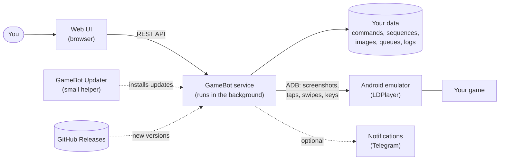

# GameBot

GameBot plays Android games for you. It runs on a Windows PC, watches an Android emulator, and taps, swipes, and
presses keys on its own. You build the automation in a web page. You do not write code.

Typical uses: collect daily rewards, run repeated tasks, and keep a game running all day.

## Contents

- [What GameBot does](#what-gamebot-does)
- [How it works](#how-it-works)
- [Install GameBot](#install-gamebot)
- [Get started: your first automation](#get-started-your-first-automation)
- [Update GameBot](#update-gamebot)
- [Settings and data](#settings-and-data)
- [Fix problems](#fix-problems)
- [Uninstall](#uninstall)
- [For developers](#for-developers)
- [More documents](#more-documents)

## What GameBot does

- **Sees the screen.** GameBot takes pictures of the emulator screen all the time. It finds images (for example a
  button) and reads text (for example a timer).
- **Acts on its own.** It taps, swipes, and presses keys. It adds small random changes to the taps and the delays.
- **Follows your plan.** You combine small actions into **commands**. You combine commands into **sequences**, with
  conditions, loops, and delays.
- **Runs all day.** A **queue** runs your sequences on one emulator. It can start a sequence at a set time, after a
  delay, or again and again.
- **Tells you what happened.** The execution logs show each step. GameBot can also send a message (for example to
  Telegram) when something goes wrong.
- **Starts the game for you.** GameBot can start the emulator and the game, and start them again if they stop.

GameBot works with **LDPlayer** (best support) and with any emulator that you can reach through ADB.

## How it works

GameBot is one program that runs in the background on your PC. You control it with a web page in your browser.
The page and the program are on the same PC (or on another PC in your network, if you choose that).



| Part | What it is |
|------|------------|
| **Web UI** | The web page where you build and control your automation. The service serves it. |
| **GameBot service** | The program in the background. It talks to the emulator, runs your queues, and keeps your data. It has a REST API, so other tools can control it too. |
| **Emulator and ADB** | GameBot uses ADB (Android Debug Bridge) to get screenshots and to send input. LDPlayer includes ADB. |
| **Vision and OCR** | GameBot finds images with OpenCV (included). It reads text with Tesseract (optional, you install it). |
| **Updater** | A small helper that installs a new version for you (see [Update GameBot](#update-gamebot)). |
| **Installer** | A normal Windows installer. It installs for your user only, so it needs no administrator rights. |

### The web UI

The menu on the left has these areas:

| Area | Use it to |
|------|-----------|
| **Authoring** | Build your automation. Tabs: **Commands**, **Games**, **Sequences**, **Images**, **Backup & Restore**, and **Update**. |
| **Queues** | Run sequences on an emulator. Set the schedule. Watch a running queue. |
| **Execution** | Connect to an emulator, see its screen, and test a command or sequence by hand. |
| **Execution Logs** | See what ran, step by step, and why a step failed. |
| **Notifications** | Set up messages (for example Telegram) for queue events. |
| **Configuration** | Set the access token, the log levels, and other settings. |

### The building blocks

| Block | Meaning |
|-------|---------|
| **Game** | The game that you automate. |
| **Image** | A small picture of something on the screen, for example a button. GameBot looks for it. You cut it out of a screenshot in the UI. |
| **Command** | A short list of steps: tap, swipe, press a key, or wait for an image. A command can tap on an image that it finds. |
| **Sequence** | Commands in order, with delays, conditions (if an image is visible), loops, and a way to run again later. |
| **Queue** | The runner. A queue belongs to one emulator and runs sequences on a schedule. Each emulator can have one running queue. |
| **Queue template** | A saved plan for a queue. You can reuse it for more than one queue. |

## Install GameBot

### What you need

- A PC with **Windows 10 or Windows 11** (64-bit).
- An Android emulator. **LDPlayer 9** is the best choice. Install it from [ldplayer.net](https://www.ldplayer.net) and
  turn on **ADB debugging** in its settings.
- The **.NET 9 runtime** (ASP.NET Core Runtime 9.x, x64). The installer does not include it. Get it from
  [dotnet.microsoft.com/download/dotnet/9.0](https://dotnet.microsoft.com/download/dotnet/9.0) and install it first.
- Your game, installed in the emulator.
- Optional: [Tesseract OCR](https://github.com/UB-Mannheim/tesseract/wiki). You need it only to read text on the
  screen. Install it and set `GAMEBOT_TESSERACT_ENABLED` to `true` (see [Settings and data](#settings-and-data)).


### Step by step

1. Open the [Releases page](https://github.com/bbqf/GameBotAI/releases) of this project.
2. Download **`GameBotInstaller.exe`** from the newest release.
3. Start the file.
   - Windows can show a blue **"Windows protected your PC"** window. This happens because the file is not signed.
     Click **More info**, then **Run anyway**. You do this one time.
4. Follow the wizard:
   - Accept the license.
   - Select the install folder. The default is `%LocalAppData%\GameBot`. Keep it unless you have a reason.
   - Select the network address and the port. The default is `127.0.0.1` (only this PC) and port `8080`.
     The installer picks the next free port (`8088`, `8888`, `80`) if `8080` is busy.
5. At the end, keep **Run GameBot background app now** selected. Click **Finish**.
6. Open the web UI: use the **GameBot** shortcut in the Start menu, or open <http://localhost:8080/> in your browser
   (use your port if it is not `8080`).

GameBot starts by itself each time you sign in to Windows. The Start menu has a **GameBot Background** shortcut to start
it by hand, and a **GameBot** shortcut that only opens the web page.

For silent install, HTTPS, and all installer options, read [INSTALL.md](INSTALL.md).

### Is it safe to open to my network?

By default GameBot listens only on the PC itself (`127.0.0.1`). If you choose `0.0.0.0` so that you can use the web
page from another PC, set an **access token** first (see [Settings and data](#settings-and-data)). GameBot has full
control of your emulator, so do not open it to the internet.

## Get started: your first automation

This short walk-through makes GameBot tap a button in your game. It takes about 15 minutes.

1. **Start the emulator and your game.** Open LDPlayer and start the game. Stay on a screen that has a button you want
   to tap.
2. **Open the web UI** at <http://localhost:8080/>.
3. **Add your game.** Open **Authoring**, then **Games**. Click **New**, type a name, and save.
4. **Connect to the emulator.** Open **Execution**. Select your game and your emulator (GameBot lists the emulators
   that ADB finds). Click **Connect**. You should see the emulator screen in the page.
   If the list is empty, see [Fix problems](#fix-problems).
5. **Cut out an image.** Open **Authoring**, then **Images**. Take a screenshot of the emulator, drag a box around the
   button, give the image a name, and save.
6. **Make a command.** Open **Authoring**, then **Commands**. Click **New**. Add a step that taps the image you saved.
   Save the command. Test it in **Execution**: GameBot should tap the button.
7. **Make a sequence.** Open **Authoring**, then **Sequences**. Add your command as a step. Add a delay or a condition
   if you want. Save the sequence.
8. **Put it in a queue.** Open **Queues**. Create a queue for your emulator. Add the sequence and set when it runs.
   Click **Start**.
9. **Watch it work.** Open **Execution Logs** to see each step and its result.

Tips:

- Start small. Test each command by hand before you put it in a queue.
- Cut images that are small and clear. Do not include parts of the screen that change (for example a timer).
- GameBot does only what you put in your sequences. Check a sequence before you run it for a long time. Be careful\n  with steps that tap on buttons that spend in-game money.
- Use **Backup & Restore** (in **Authoring**) to save your commands, sequences, and images as a zip file.

## Update GameBot

You do not have to download the installer again.

1. Open the web UI on the PC that runs GameBot.
2. Open **Authoring**, then the **Update** tab. Click **Check for Update**.
3. If a new version exists, click **Install update**. Read the warning and confirm.
   **All running queues stop at once.** Queues that you set to resume after a restart start again by themselves.
4. Wait. GameBot downloads the update, installs it, and starts again. The page shows the result.

Windows shows no warning during an update. If an update fails, the old version still works, and the page shows what
went wrong. You can install an update only from the PC that runs GameBot.

## Settings and data

Your data is in `%LocalAppData%\GameBot\data`: games, commands, sequences, images, queues, logs, and settings.
Use **Backup & Restore** to make a copy.

The most used settings:

| Setting | How to set it | Use |
|---------|---------------|-----|
| Access token | Environment variable `GAMEBOT_AUTH_TOKEN` | If set, every request needs this token. Enter the same token in **Configuration** in the web UI. |
| Data folder | `GAMEBOT_DATA_DIR` | Move your data to another folder. |
| Port and address | The installer wizard | Change them by running the installer again. |
| Tesseract OCR | `GAMEBOT_TESSERACT_ENABLED=true`, `GAMEBOT_TESSERACT_PATH` | Read text on the screen. |
| ADB program | `GAMEBOT_ADB_PATH` | Use a different `adb.exe`. GameBot finds the one in LDPlayer by itself. |
| Logs | **Configuration** in the web UI | Change the log level of each part while GameBot runs. |
| Update source | `Update__Repository` | The GitHub project that GameBot checks for updates. |

To set an environment variable for your user, open Windows Settings, search for "environment variables", and add the
variable. Restart GameBot after you change it. [ENVIRONMENT.md](ENVIRONMENT.md) lists all variables.

## Fix problems

| Problem | What to do |
|---------|------------|
| The web page does not open. | Start **GameBot Background** from the Start menu. Check the port: the installer can pick `8088` or `8888` if `8080` is busy. |
| No emulator in the list. | Start the emulator. Turn on ADB debugging in LDPlayer. Restart GameBot. |
| GameBot cannot find an image. | Cut the image again from a fresh screenshot. Lower the match threshold a little. Do not include changing parts. |
| A step taps at the wrong place. | Make sure that the emulator resolution did not change after you cut the images. |
| Windows blocks the installer. | See step 3 of [Install GameBot](#install-gamebot). |
| An update fails. | Read the message on the **Update** tab. It has an error code and a hint. The Windows Installer log is in `%LocalAppData%\GameBot\data\updates`. |
| The installer fails. | Read the newest file in `%LocalAppData%\GameBot\Installer\logs`. See [INSTALL.md](INSTALL.md). |

## Uninstall

Open Windows **Settings**, then **Apps**, then **Installed apps**. Select **GameBot** and click **Uninstall**.
Your data folder stays. Delete `%LocalAppData%\GameBot\data` yourself if you do not need it.

## For developers

GameBot is a .NET 9 (C#) service with a React and TypeScript web UI.

```text
src/GameBot.Domain     Core logic: commands, sequences, queues, vision, OCR, execution logs
src/GameBot.Emulator   ADB client, sessions, screen capture
src/GameBot.Service    ASP.NET Core host: REST API, queue and sequence execution, serves the web UI
src/GameBot.Updater    Helper program that installs updates
src/web-ui             React + TypeScript + Vite web UI
installer/             WiX installer (MSI and EXE bootstrapper)
tests/                 Unit, contract, and integration tests
specs/                 One folder for each feature: spec, plan, and tasks
```

Run from source (needs the .NET 9 SDK and Node.js):

```powershell
# Terminal 1: the service. The API and Swagger UI are at http://localhost:5081/swagger
dotnet run -c Release --project src/GameBot.Service

# Terminal 2: the web UI with live reload
cd src/web-ui
npm install
npm run dev
```

Build and test:

```powershell
dotnet build GameBot.sln -c Release   # warnings are errors; analyzers are on
dotnet test GameBot.sln -c Release
cd src/web-ui; npm test               # web UI tests
```

Build an installer: `.\scripts\build-installer.ps1 -Configuration Release`.

Publish a release (owner): start the `release-installer` workflow on `master` with `publish_release` set to `true`.
Installed bots see only releases that you publish this way. See [installer/README.md](installer/README.md).

The REST API is described by Swagger at `/swagger` on the running service. A bot that runs from source cannot
update itself. Only an installed bot can.

## More documents

- [docs/architecture.md](docs/architecture.md): the current architecture, domain model, and API surface.
- [INSTALL.md](INSTALL.md): all installer options, silent install, ports, HTTPS, and exit codes.
- [ENVIRONMENT.md](ENVIRONMENT.md): all environment variables.
- [VERSIONING.md](VERSIONING.md): how version numbers work.
- [CHANGELOG.md](CHANGELOG.md): what changed in each version.
- [specs/STATUS.md](specs/STATUS.md): the history of each feature.
- [LICENSE](LICENSE) (GPL) and [LICENSE_NOTICE.md](LICENSE_NOTICE.md): licenses of this project and its parts.
